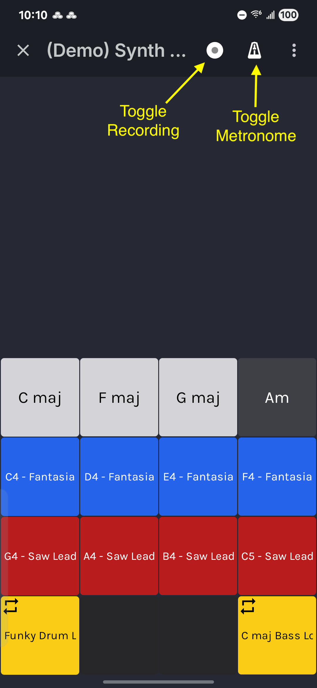
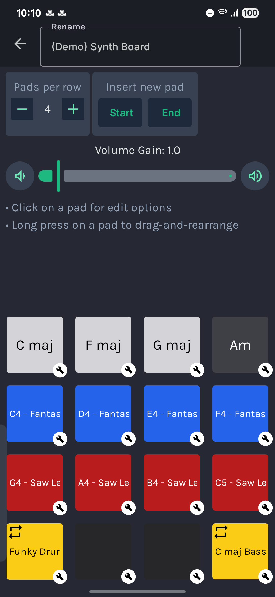
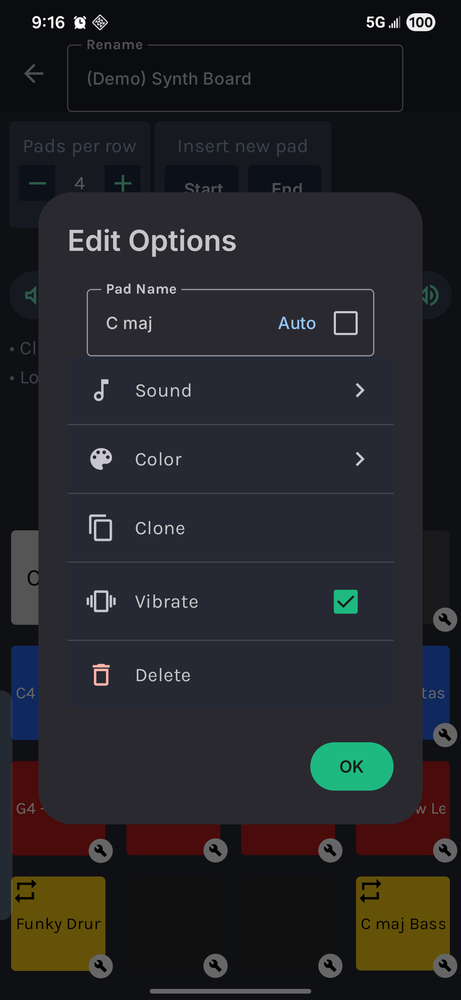
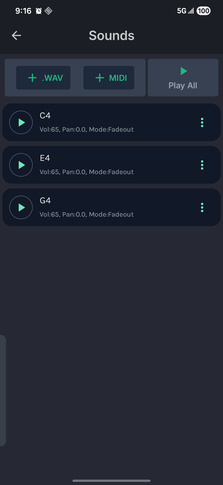
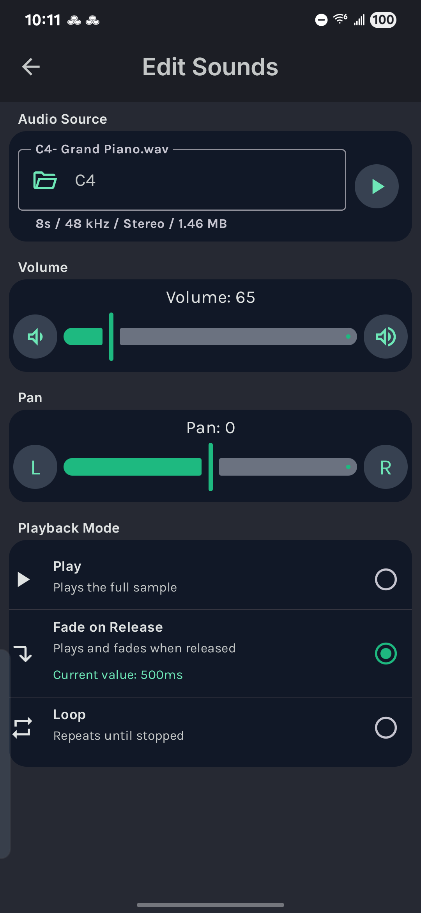
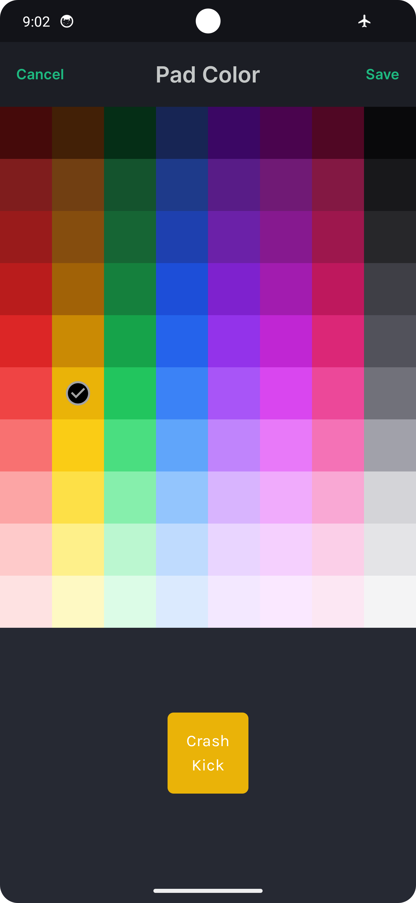

# Sound Pads Android

Unleash your inner musician with Sound Pads! Turn your Android device into a fun, dynamic soundboard.

## Features

1. **Jam in Real-Time**
   * Tap and play instantly. Drums, keyboards, and more!

2. **Record Your Tracks**
   * Save your music and share it anytime.

3. **Stay on Beat**
   * Use the metronome to keep perfect timing.

4. **Create Your Style**
   * Customize your soundboard however you like.

5. **Import/Export Boards**
   * Export and share your customized sound board as well as download boards created by others creators.

6. **Use as Midi Keyboard**
   * Connet your phone to DAW on your PC as [MIDI Keyboard](midi-keyboard/midi_input_guide.md)
## Demo

### Drums Demo

## Screenshots

<table>
   <tr>
      <td style='text-align:center;'>
         
          
         <figcaption>Board List Screen</figcaption>
      </td>
      <td style='text-align:center;'>
         
          
         <figcaption>Board Screen</figcaption>
      </td>
      <td style='text-align:center;'>
         
          
         <figcaption>Edit Board Mode</figcaption>
      </td>
   </tr>
   <tr>
      <td style='text-align:center;'>
         
          
         <figcaption>Edit Pad Options</figcaption>
      </td>
      <td style='text-align:center;'>
         
          
         <figcaption>Samples List</figcaption>
      </td>
      <td style='text-align:center;'>
         
          
         <figcaption>Samples Editor</figcaption>
      </td>
   </tr>
   <tr>
    <td style='text-align:center;'>
         
          
         <figcaption>Edit Pad Color</figcaption>
      </td>
   </tr>
</table>
