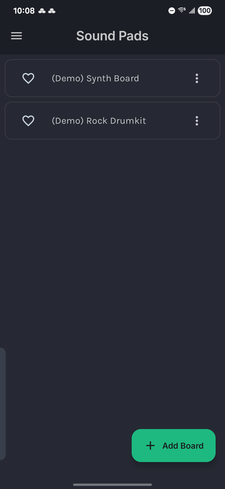
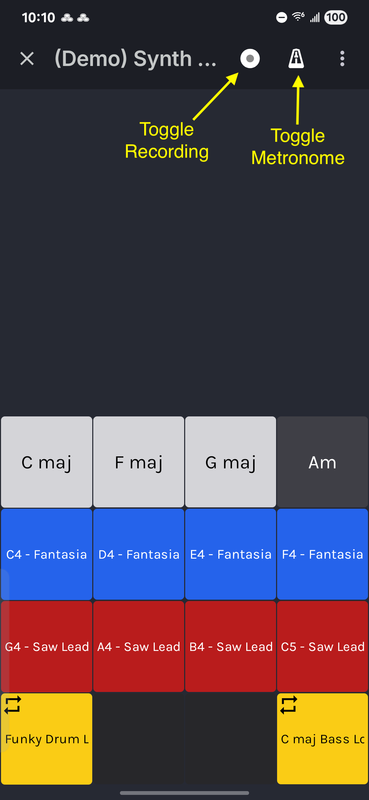
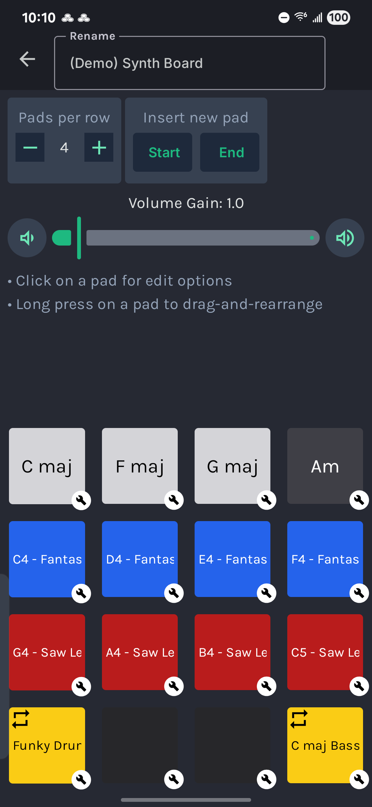
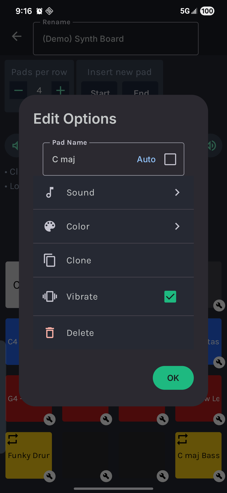
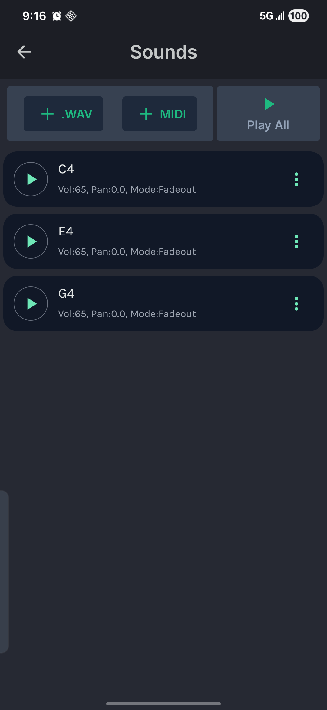
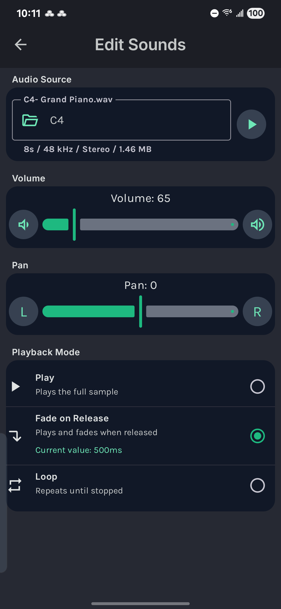
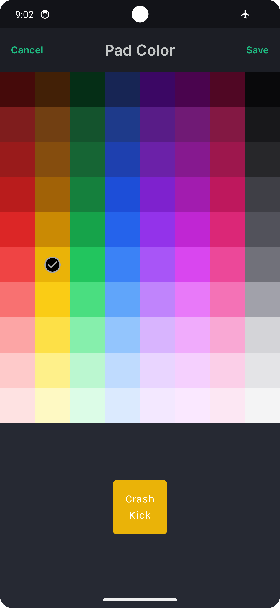
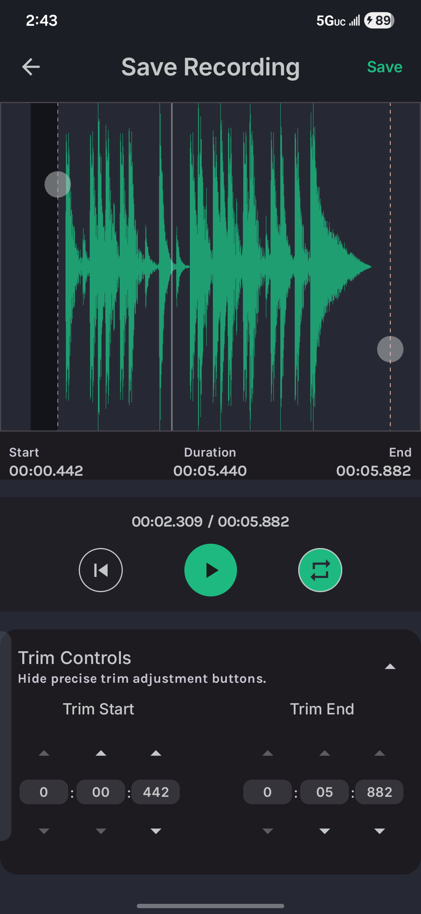

# Sound Pads

Play, record, and share your own sound pads.

A simple way to build custom boards for drums, keys, loops, and live sessions directly on your phone.

[Website](https://prabint.github.io/soundpads-presets/)

[Get it on Google Play](https://play.google.com/store/apps/details?id=prabin.timsina.soundpads)

## Downloadables

- [Presets](https://prabint.github.io/soundpads-presets/presets/)
- [Sample Packs](https://prabint.github.io/soundpads-presets/samples/)

## Guides

- [MIDI Setup Guide](https://prabint.github.io/soundpads-presets/midi-keyboard/)
- [Custom Board Guide](https://www.youtube.com/shorts/-Y8pCTs9N5c)

## Features

1. **Real-time Playing**
   * Tap pads instantly for smooth jam sessions and practice.

2. **Recording**
   * Capture your takes and revisit your ideas whenever needed.

3. **Metronome**
   * Keep your rhythm steady while learning or building tracks.

4. **Custom Boards**
   * Adjust samples, names, and pad colors to fit your setup.

5. **Import and Export**
   * Share your board presets and load packs from others.

6. **MIDI Mode**
   * Connect your phone to a DAW and use it as a [MIDI controller](midi-keyboard/midi_input_guide.md).

## Demo

### Drums Demo

## Screenshots

<table>
   <tr>
      <td style='text-align:center;'>
         
          
         <figcaption>Board List Screen</figcaption>
      </td>
      <td style='text-align:center;'>
         
          
         <figcaption>Board Screen</figcaption>
      </td>
      <td style='text-align:center;'>
         
          
         <figcaption>Edit Board Mode</figcaption>
      </td>
   </tr>
   <tr>
      <td style='text-align:center;'>
         
          
         <figcaption>Edit Pad Options</figcaption>
      </td>
      <td style='text-align:center;'>
         
          
         <figcaption>Samples List</figcaption>
      </td>
      <td style='text-align:center;'>
         
          
         <figcaption>Samples Editor</figcaption>
      </td>
   </tr>
   <tr>
      <td style='text-align:center;'>
         
          
         <figcaption>Edit Pad Color</figcaption>
      </td>
      <td style='text-align:center;'>
         
          
         <figcaption>Trim Recording</figcaption>
      </td>
   </tr>
</table>
